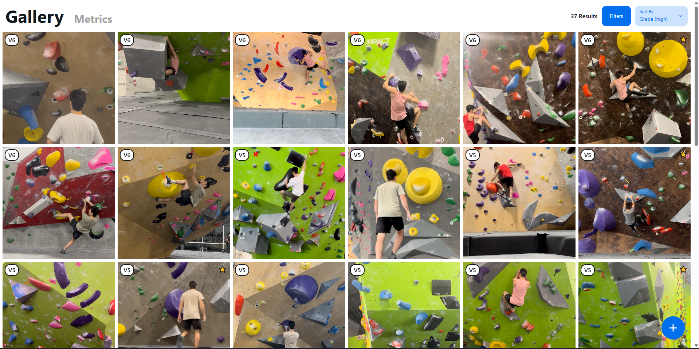
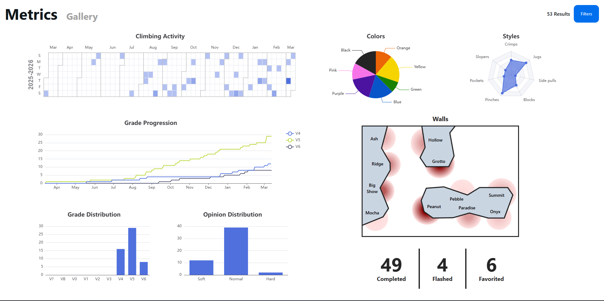

# ClimbDB

ClimbDB is built to catalogue my bouldering progress as I continue to become a better climber. This project consists of two main use cases: 
- A gallery where I can view, add, and manage all my completed climbs
- A metrics page where I can see trends in my overall performance, helping me better understand what needs improvement
fdgdfg

